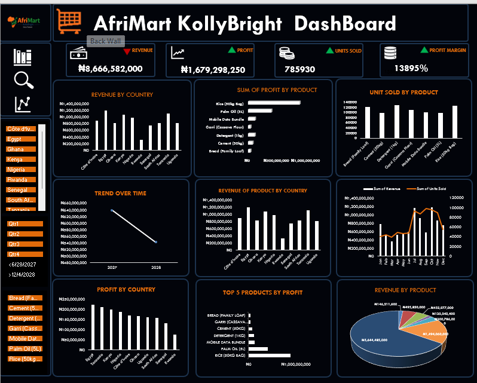

# AfriMart_KollyBright_Sales_Dashboard

## Project Overview
This project analyzes sales data for **AfriMart KollyBright**, a fictional African retail company.
The goal of the dashboard is to help management quickly understand sales performance, 
profitability, revenue, and trends across countries and products using Microsoft Excel.

This project was created as part of a data analysis portfolio to demonstrate 
Excel dashboarding, data summarization, data cleaning, and business insight skills.

## Business Questions Answered
- What is the total revenue, profit, and units sold?
- Which countries generate the highest revenue?
- Which products are the most profitable?
- How does revenue Change oveer time?
- Which products perform best in different region?
---
## Key KPIs
---
- Total Revenue
- Total Profit
- Total Units Sold
- Profit Margin
---
### Tools Used
- Microsoft Excel
- Pivot Tables
- Pivot Charts
- Excel Slicers
- Dashboard Design Techniques

  ---
  ## Dashboard Preview
  

## Key Insights
- Egypt contributed the highest share of total revenue.
- Some products recorded high sales volume but lower profit marrgins.
- Revenue trend show consistent growth over time.
- Product performance vary significantly by country.
---
## Files in this Repository
- [Sales Dataset](AfriMart_KollyBright_Sales_DashBoard.xlsx)
- [Company Logo](AfriMart_KollyBright_Sales_Logo.png)
- [Dashboard Screenshot](AfriMart-KollyBright-Screenshot-2026-10-01.png)
- README.md
---
## Conclusion

The AfriMart KollyBright dashboard shows strong overall sales performance, generating approximately ₦8.67 billion in revenue and ₦1.68 billion in profit from 785,930 units sold. 
Rice appears to be the major contributor to revenue and profit, while performance varies across countries. 
However, the declining trend over time suggests the need for closer monitoring and strategic action to sustain growth and profitability.

  
